# QA Insight AI 🔭

> **360° AI-Powered Software Testing Intelligence Platform**
> Local-LLM capable · Multi-framework · OpenShift/Kubernetes native · MCP-enabled

[](LICENSE)
[](https://python.org)
[](https://reactjs.org)
[](https://fastapi.tiangolo.com)
[](https://modelcontextprotocol.io)

## Overview

QA Insight AI bridges the gap between automated test execution and defect resolution. It ingests test results from 50+ frameworks, applies a LangChain ReAct agent (running locally via Ollama — **no internet required**) to correlate failures across stack traces, Splunk logs, and Kubernetes pod events, and pushes structured root-cause summaries to Jira in one click.

It also ships a first-class **MCP (Model Context Protocol) server** so AI assistants (AI Desktop Clients, IDE plugins, CI pipelines) can query test quality, investigate failures, and gate releases through natural-language conversations — no browser required.

## Key Features

| Domain | Capability |
|--------|-----------|
| **Ingestion** | TestNG, JUnit, Allure, Cucumber, pytest, Robot Framework, JUnit XML (universal) |
| **AI Triage** | LangChain ReAct agent · 5 investigation tools · Ollama/OpenAI/Gemini |
| **Offline AI** | Fully air-gapped with Ollama (qwen2.5, llama3, mistral) |
| **Dashboards** | Pass/fail trends, coverage heatmaps, flaky leaderboard, defect burn-down |
| **Quality Gates** | Automated GO/NO-GO feedback to Jenkins/GitHub Actions |
| **Security** | JWT-based authentication with role-based access control (RBAC) |
| **MCP Server** | 20 tools · 10 resources · 6 prompt workflows for AI assistant integration |
| **Search** | Full-text + semantic RAG search across all test history |
| **Integrations** | Jira, Splunk, OpenShift API, Slack, Teams, GitHub Issues |

## Architecture

```
[Java/Python/JS Tests] → [Jenkins/GHA] → [MinIO S3] → [FastAPI Backend]
                                                              ↓
                                    [PostgreSQL] ←─── [Ingestion Service]
                                    [MongoDB]    ←─── [Allure/TestNG Parser]
                                          ↓
                              [LangChain ReAct Agent]
                              [Ollama (local) / OpenAI]
                                          ↓
                   ┌──────────────────────┴──────────────────────┐
                   ↓                                             ↓
         [React Dashboard] → [Jira Tickets]          [MCP Server :8002]
                                                           ↓
                                               [MCP Client / IDE / CI]
```

## System Architecture

The following diagram illustrates the microservices, data flow, Agentic AI integration, and MCP layer for QA Insight AI:

```mermaid
graph TD
    subgraph Client_Layer [Client & Ingestion Layer]
        UI[React SPA Frontend]
        SDK[Client SDKs: Java, Python, JS, .NET]
        CICD[CI/CD: Jenkins, GitHub Actions]
        MCP_CLIENT[AI Clients: MCP Client / IDE / CI]
    end

    subgraph MCP_Layer [MCP Integration Layer]
        MCP[MCP Server :8002]
        MCP_TOOLS[20 Tools]
        MCP_RES[10 Resources]
        MCP_PROMPTS[6 Prompt Workflows]
    end

    subgraph API_Layer [API & Application Layer]
        FastAPI[FastAPI Backend Service]
        REST[REST API & Webhook SDK]
        SSE[SSE / WebSocket Streaming]
        Auth[JWT Authentication & Security Middleware]
        Analytics[Analytics Engine]
        MockGen[Mock Data Generator]
    end

    subgraph AI_Intelligence_Layer [AI & Intelligence Layer]
        Agent[LangChain ReAct Agent]
        Factory[LLM Factory Abstraction]
        Ollama[Ollama Service / Local LLM]
        CloudLLM[Cloud API: OpenAI / Gemini]
        RAG[Semantic Search / Embeddings]
    end

    subgraph Async_Processing_Layer [Async Processing Layer]
        Redis[Redis Message Broker]
        Worker[Celery Auto-Analyzer Worker]
        Gates[Quality Gate Engine]
    end

    subgraph Data_Persistence_Layer [Data Persistence Layer]
        PG[(PostgreSQL - Relational)]
        Mongo[(MongoDB - Unstructured)]
        MinIO[(MinIO - Object Storage)]
        Chroma[(ChromaDB - Vector Store)]
    end

    subgraph External_Integrations [External Integrations]
        Jira[Bug Tracking: Jira]
        Slack[Notifications: Slack / Teams]
    end

    %% MCP Client connections
    MCP_CLIENT -->|MCP Protocol stdio/SSE| MCP
    MCP --> MCP_TOOLS
    MCP --> MCP_RES
    MCP --> MCP_PROMPTS
    MCP_TOOLS -->|HTTP/REST + JWT| FastAPI
    MCP_RES -->|HTTP/REST + JWT| FastAPI

    %% Client to API Connections
    UI -->|HTTP/REST| FastAPI
    UI -->|Real-Time Data| SSE
    UI -->|Auth & Token| Auth
    UI -->|Trend Data| Analytics
    SDK -->|Test Results| REST
    CICD -->|Trigger/Webhooks| REST
    CICD -->|Quality Gate check via MCP| MCP
    REST --> FastAPI
    SSE --- FastAPI
    Auth --- FastAPI
    Analytics --- FastAPI

    %% API to Storage Connections
    FastAPI -->|Structured Metrics| PG
    FastAPI -->|Raw Logs| Mongo
    FastAPI -->|Artifacts| MinIO
    FastAPI -->|Enqueue Jobs| Redis
    MockGen -->|Simulate Results| PG
    MockGen -->|Simulate Logs| Mongo

    %% Async Worker Connections
    Redis -->|Consume Jobs| Worker
    Worker -->|Update Status| PG
    Worker -->|Evaluate Rules| Gates
    Gates -->|GO/NO-GO Webhooks| CICD
    Gates -->|Alerts| Slack

    %% AI Connections
    FastAPI -->|Trigger AI Triage| Agent
    Worker -->|Tier 3 Background Triage| Agent
    Worker -->|Tier 2 Similarity Matching| RAG
    RAG <-->|Query Vectors| Chroma
    Agent -->|Route Provider| Factory
    Factory -->|Air-Gapped Inference| Ollama
    Factory -->|Cloud Inference| CloudLLM

    %% External Tool Invocations
    Agent -->|Auto-Create Defects| Jira
```



## Quick Start (Local Development)

### Prerequisites
- Docker Desktop 4.x+
- Node.js 20 LTS
- Python 3.11+

### 1. Clone & Configure
```bash
git clone https://github.com/yourorg/qainsight-ai.git
cd qainsight-ai
cp .env.example .env
# Edit .env — see Environment Variables section
```

### 2. Start the Stack
```bash
docker compose up -d --build
```

### 3. Run Migrations
```bash
docker compose exec backend alembic upgrade head
```

### 4. Pull Local LLM (Ollama)
```bash
docker compose exec ollama ollama pull qwen2.5:7b
docker compose exec ollama ollama pull nomic-embed-text
```

### 5. Access Services
| Service | URL | Credentials |
|---------|-----|-------------|
| Dashboard | http://localhost:3000 | Register via API Docs first |
| API Docs | http://localhost:8000/docs | — |
| MinIO Console | http://localhost:9001 | admin / password123 |
| Flower (Celery) | http://localhost:5555 | — |
| MCP SSE Server | http://localhost:8002/sse | — |

### 6. Connect the MCP Server (AI Assistant)

Install dependencies and configure your MCP client:

```bash
make mcp-install
```

Add to your MCP client configuration (e.g., Claude Desktop, Cursor, etc.):

```json
{
  "mcpServers": {
    "qainsight": {
      "command": "python",
      "args": ["/absolute/path/to/qainsight-ai/mcp/server.py"],
      "env": {
        "QAINSIGHT_API_URL": "http://localhost:8000",
        "QAINSIGHT_USERNAME": "your-user",
        "QAINSIGHT_PASSWORD": "your-pass"
      }
    }
  }
}
```

Then ask the AI Assistant: *"List all QA projects"* or *"Check release readiness for project-alpha"*.

## Project Structure

```
qainsight-ai/
├── backend/                    # FastAPI Python backend
│   ├── app/
│   │   ├── main.py             # Application entry point
│   │   ├── core/               # Config, security, dependencies
│   │   ├── routers/            # API route handlers
│   │   ├── services/           # Business logic
│   │   ├── tools/              # LangChain agent tools (5 tools)
│   │   ├── models/             # SQLAlchemy ORM + Pydantic schemas
│   │   ├── db/                 # Database connections
│   │   └── worker/             # Celery background tasks
│   ├── migrations/             # Alembic migrations
│   ├── tests/                  # pytest test suite
│   ├── requirements.txt
│   └── Dockerfile
├── frontend/                   # React + Vite SPA
│   ├── src/
│   │   ├── pages/              # Route-level page components (incl. LoginPage)
│   │   ├── components/         # Reusable UI components & ProtectedRoute
│   │   ├── services/           # API client layer with auth interceptors
│   │   ├── hooks/              # Custom React hooks (SWR)
│   │   ├── store/              # Zustand state management (authStore)
│   │   └── utils/              # Helpers and formatters
│   ├── package.json
│   └── Dockerfile
├── mcp/                        # MCP Server — AI assistant integration
│   ├── server.py               # Entry point (stdio + SSE transport)
│   ├── config.py               # Settings (QAINSIGHT_API_URL, credentials)
│   ├── client.py               # httpx async client with JWT auto-auth
│   ├── tools/                  # 20 callable tools
│   ├── resources/              # 10 readable resources (qainsight:// URIs)
│   ├── prompts/                # 6 investigation workflow templates
│   ├── Dockerfile
│   └── requirements.txt
├── k8s/                        # Kubernetes/OpenShift manifests
│   ├── base/                   # Kustomize base resources
│   └── overlays/               # Environment-specific patches (dev/staging/prod)
├── infra/cloudrun/             # Cloud Run + Cloud SQL deployment assets
├── .github/workflows/ci.yml    # GitHub Actions CI/CD pipeline
├── docker-compose.yml          # Local development stack
├── .env.example                # Environment variable template
├── Makefile                    # Developer convenience commands
└── scripts/                    # Setup and utility scripts
```

## Development

```bash
# Start all services
make dev

# Run backend tests
make test-backend

# Run frontend tests
make test-frontend

# Apply DB migrations
make migrate

# Lint all code
make lint

# Build production images
make build

# MCP server (local — for AI Assistants)
make mcp-install && make mcp-start

# MCP server (SSE — for CI/web clients)
make mcp-sse
```

## MCP Server

QA Insight AI ships a full MCP server under `mcp/` that gives AI assistants direct access to your test quality data.

### Available Tools (20)

| Group | Tools |
|-------|-------|
| Auth | `login`, `health_check` |
| Projects | `list_projects`, `get_project`, `create_project` |
| Runs | `list_test_runs`, `get_run_details`, `list_test_cases`, `get_test_case` |
| Metrics | `get_dashboard_metrics`, `get_test_trends` |
| Analytics | `get_flaky_tests`, `get_failure_categories`, `get_top_failing_tests`, `get_coverage_report`, `get_defects`, `get_ai_analysis_summary` |
| Analysis | `trigger_ai_analysis`, `search_tests` |
| Release | `check_release_readiness` |

### Available Prompts (6)

| Prompt | Workflow |
|--------|---------|
| `investigate_failure` | Full root-cause investigation for a failing test |
| `release_readiness_report` | Executive go/no-go assessment |
| `weekly_quality_digest` | Weekly summary for team sharing |
| `flakiness_investigation` | Deep-dive with remediation plan |
| `defect_triage_session` | Structured defect prioritisation |
| `suite_health_check` | Health report for a specific test suite |

### Example Conversations

```
You: "What's our pass rate this week for project-alpha?"
You: "Why is CheckoutTest failing? Investigate it."
You: "Can we release v2.4.0 today?"
You: "Which tests are most flaky this month?"
You: "Generate the weekly quality digest for project-alpha"
```

## Iterative Development Plan

| Phase | Focus | Weeks |
|-------|-------|-------|
| **Phase 1** | Infrastructure foundation (DB, MinIO, skeleton APIs) | 1–2 |
| **Phase 2** | Java ingestion pipeline (Allure JSON + TestNG XML) | 3–4 |
| **Phase 3** | Core dashboards (Executive, Run Explorer, Log Viewer) | 5–6 |
| **Phase 4** | Coverage, trends, failure analysis, search | 7–8 |
| **Phase 5** | AI triage agent (Ollama + LangChain ReAct) | 9–10 |
| **Phase 6** | Quality Gates, manual test management, BDD | 11–12 |
| **Phase 7** | MCP Server — AI assistant integration layer | 13 |
| **Phase 8** | Production deployment (OpenShift + CI/CD) | 14–15 |

## Environment Variables

See [`.env.example`](.env.example) for complete reference.

Key variables:
- `LLM_PROVIDER` — `ollama` (default, offline) | `openai` | `gemini`
- `LLM_MODEL` — `qwen2.5:7b` (default for Ollama)
- `AI_OFFLINE_MODE` — `true` enforces local-only inference
- `JWT_SECRET_KEY` — randomly generated secret for encoding authentication tokens
- `MCP_USERNAME` / `MCP_PASSWORD` — credentials for the containerised MCP service

## License

Apache 2.0 — see [LICENSE](LICENSE)
