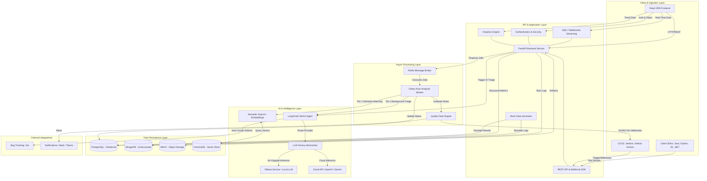

# QA Insight AI 🔭

> **360° AI-Powered Software Testing Intelligence Platform**  
> Local-LLM capable · Multi-framework · OpenShift/Kubernetes native

[](LICENSE)
[](https://python.org)
[](https://reactjs.org)
[](https://fastapi.tiangolo.com)

## Overview

QA Insight AI bridges the gap between automated test execution and defect resolution. It ingests test results from 50+ frameworks, applies a LangChain ReAct agent (running locally via Ollama — **no internet required**) to correlate failures across stack traces, Splunk logs, and Kubernetes pod events, and pushes structured root-cause summaries to Jira in one click.

## Key Features

| Domain | Capability |
|--------|-----------|
| **Ingestion** | TestNG, JUnit, Allure, Cucumber, pytest, Robot Framework, JUnit XML (universal) |
| **AI Triage** | LangChain ReAct agent · 5 investigation tools · Ollama/OpenAI/Gemini |
| **Offline AI** | Fully air-gapped with Ollama (qwen2.5, llama3, mistral) |
| **Dashboards** | Pass/fail trends, coverage heatmaps, flaky leaderboard, defect burn-down |
| **Quality Gates** | Automated GO/NO-GO feedback to Jenkins/GitHub Actions |
| **Test Management** | Manual test cases, BDD/Gherkin, requirements traceability |
| **Search** | Full-text + semantic RAG search across all test history |
| **Integrations** | Jira, Splunk, OpenShift API, Slack, Teams, GitHub Issues |

## Architecture

```
[Java/Python/JS Tests] → [Jenkins/GHA] → [MinIO S3] → [FastAPI Backend]
                                                              ↓
                                    [PostgreSQL] ←─── [Ingestion Service]
                                    [MongoDB]    ←─── [Allure/TestNG Parser]
                                          ↓
                              [LangChain ReAct Agent]
                              [Ollama (local) / OpenAI]
                                          ↓
                              [React Dashboard] → [Jira Tickets]
```

## System Architecture

The following diagram illustrates the microservices, data flow, and Agentic AI integration for QA Insight AI:


## Quick Start (Local Development)

### Prerequisites
- Docker Desktop 4.x+
- Node.js 20 LTS
- Python 3.11+

### 1. Clone & Configure
```bash
git clone https://github.com/yourorg/qainsight-ai.git
cd qainsight-ai
cp .env.example .env
# Edit .env — see Environment Variables section
```

### 2. Start the Stack
```bash
docker compose up -d --build
```

### 3. Run Migrations
```bash
docker compose exec backend alembic upgrade head
```

### 4. Pull Local LLM (Ollama)
```bash
docker compose exec ollama ollama pull qwen2.5:7b
docker compose exec ollama ollama pull nomic-embed-text
```

### 5. Access Services
| Service | URL | Credentials |
|---------|-----|-------------|
| Dashboard | http://localhost:3000 | - |
| API Docs | http://localhost:8000/docs | - |
| MinIO Console | http://localhost:9001 | admin / password123 |
| Flower (Celery) | http://localhost:5555 | - |

## Project Structure

```
qainsight-ai/
├── backend/                    # FastAPI Python backend
│   ├── app/
│   │   ├── main.py             # Application entry point
│   │   ├── core/               # Config, security, dependencies
│   │   ├── routers/            # API route handlers
│   │   ├── services/           # Business logic
│   │   ├── tools/              # LangChain agent tools
│   │   ├── models/             # SQLAlchemy ORM + Pydantic schemas
│   │   ├── db/                 # Database connections
│   │   └── worker/             # Celery background tasks
│   ├── migrations/             # Alembic migrations
│   ├── tests/                  # pytest test suite
│   ├── requirements.txt
│   └── Dockerfile
├── frontend/                   # React + Vite SPA
│   ├── src/
│   │   ├── pages/              # Route-level page components
│   │   ├── components/         # Reusable UI components
│   │   ├── services/           # API client layer
│   │   ├── hooks/              # Custom React hooks
│   │   ├── store/              # Zustand state management
│   │   └── utils/              # Helpers and constants
│   ├── package.json
│   └── Dockerfile
├── k8s/                        # Kubernetes/OpenShift manifests
│   ├── base/                   # Kustomize base resources
│   └── overlays/               # Environment-specific patches
├── .github/workflows/          # GitHub Actions CI/CD
├── docker-compose.yml          # Local development stack
├── docker-compose.prod.yml     # Production compose override
├── .env.example                # Environment variable template
├── Makefile                    # Developer convenience commands
└── scripts/                    # Setup and utility scripts
```

## Development

```bash
# Start all services
make dev

# Run backend tests
make test-backend

# Run frontend tests
make test-frontend

# Apply DB migrations
make migrate

# Lint all code
make lint

# Build production images
make build
```

## Iterative Development Plan

| Phase | Focus | Weeks |
|-------|-------|-------|
| **Phase 1** | Infrastructure foundation (DB, MinIO, skeleton APIs) | 1–2 |
| **Phase 2** | Java ingestion pipeline (Allure JSON + TestNG XML) | 3–4 |
| **Phase 3** | Core dashboards (Executive, Run Explorer, Log Viewer) | 5–6 |
| **Phase 4** | Coverage, trends, failure analysis, search | 7–8 |
| **Phase 5** | AI triage agent (Ollama + LangChain ReAct) | 9–10 |
| **Phase 6** | Quality Gates, manual test management, BDD | 11–12 |
| **Phase 7** | Production deployment (OpenShift + CI/CD) | 13–14 |

## Environment Variables

See [`.env.example`](.env.example) for complete reference.

Key variables:
- `LLM_PROVIDER` — `ollama` (default, offline) | `openai` | `gemini`
- `LLM_MODEL` — `qwen2.5:7b` (default for Ollama)
- `AI_OFFLINE_MODE` — `true` enforces local-only inference

## License

Apache 2.0 — see [LICENSE](LICENSE)
